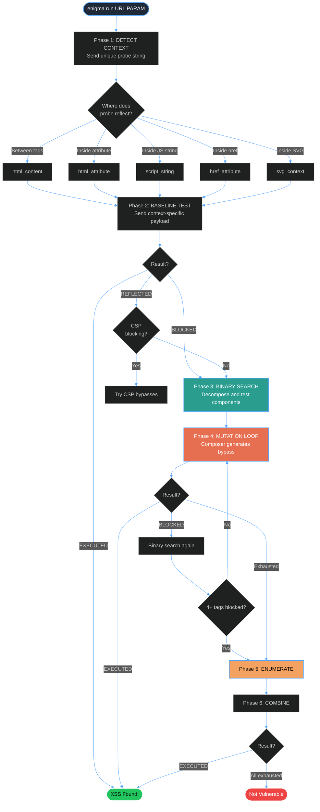
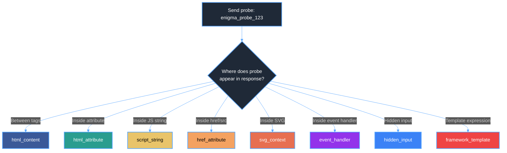
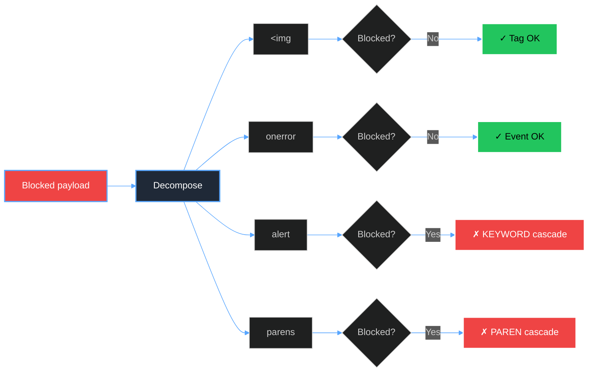
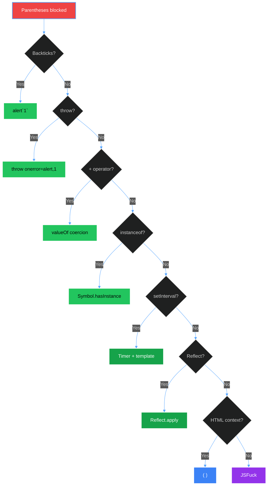
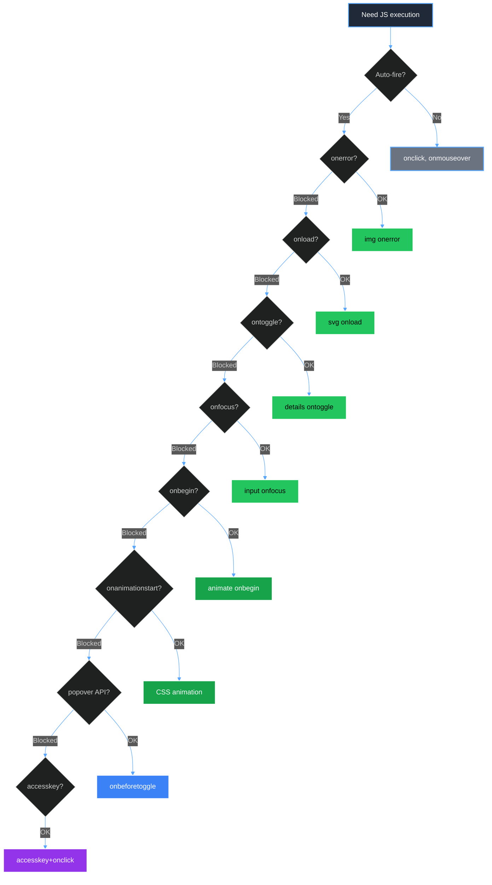
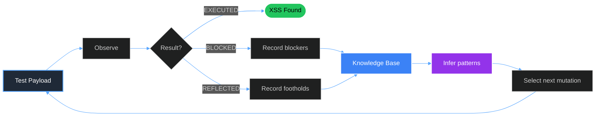
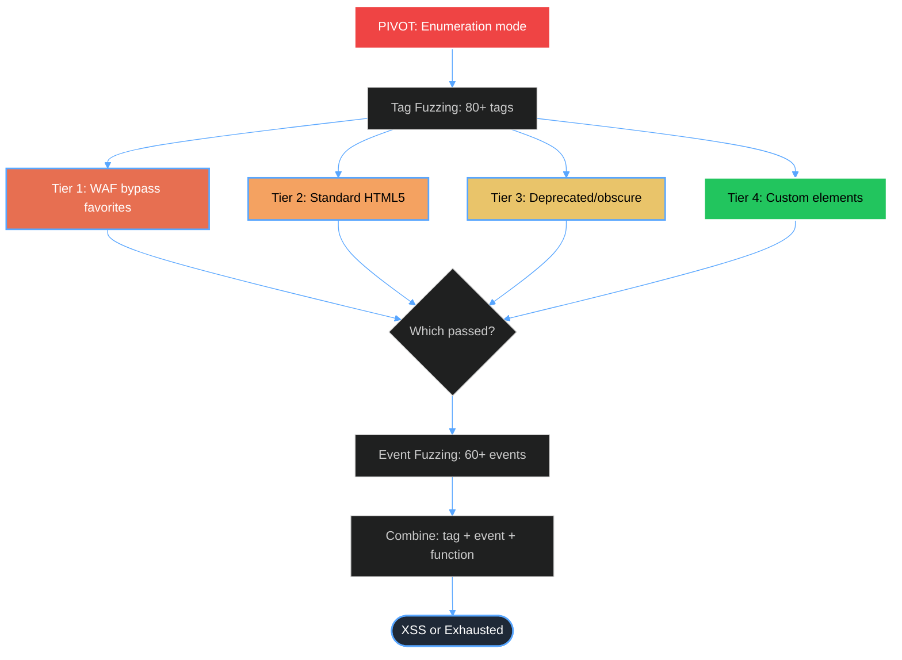

Cross-site scripting remains one of the most persistent vulnerability classes on the web. Not because we lack detection tools — we have dozens — but because the tools we have are fundamentally dumb. They throw wordlists at endpoints and hope something sticks. When a WAF blocks `<script>alert(1)</script>`, they have no idea *why* it was blocked, and they have no strategy for what to try next.

Enigma takes a different approach. It's an autonomous engine — one that probes, learns what the WAF blocks, and systematically works through bypass cascades until it finds execution or exhausts all known techniques. It doesn't guess. It asks questions, observes answers, and adapts.

This post walks through how the engine works, why the Enigma machine metaphor fits perfectly, and the decision trees that drive its bypass logic.

## Credit

The underlying methodology — the "5-Rotor" framework, the cascade orders, the systematic context-aware approach to XSS — comes from the work of [Gareth Heyes](https://x.com/garaborr) ([@garethheyes](https://portswigger.net/research/gareth-heyes)), a researcher at PortSwigger. His book [*JavaScript for Hackers*](https://www.amazon.co.uk/JavaScript-Hackers-Learn-Think-Like/dp/1119860555) provides the most systematic framework for XSS that exists. I built Enigma to encode that methodology into something a machine can execute autonomously.

## Why "Enigma"? The Rotor Metaphor

The name isn't arbitrary. The original Enigma machine used mechanical rotors — wheels that could each be set independently, and whose combined positions determined the cipher output. Change one rotor, get a different result. Change two, get something entirely different. The combinatorial explosion of rotor positions is what made Enigma hard to crack.

XSS bypass works the same way. A payload that achieves execution is the product of five independent decisions:

1. **Where** does the input land? (Context)
2. **What** is the WAF blocking? (Blockers)
3. **How** should characters be represented? (Encoding)
4. **What** syntax structure carries the payload? (Structure)
5. **How** does the JavaScript fire? (Execution)

Each decision is a rotor. Each rotor has multiple positions. The WAF is the machine you're trying to break. And just like Bletchley Park's approach, you don't brute-force all combinations — you use what you learn from each test to constrain the search space.

```mermaid
%%{init: {'theme': 'dark', 'themeVariables': { 'lineColor': '#58a6ff', 'primaryTextColor': '#fff'}}}%%
graph LR
    INPUT["User Input"] --> R1

    subgraph ENIGMA["The 5 Rotors"]
        R1["R1: Context<br/>Where does input land?"]
        R2["R2: Blockers<br/>What does WAF stop?"]
        R3["R3: Encoding<br/>Character representation"]
        R4["R4: Structure<br/>Syntax-level bypass"]
        R5["R5: Execution<br/>How JS fires"]
    end

    R1 --> R2 --> R3 --> R4 --> R5

    R5 --> OUTPUT["XSS Payload"]

    style INPUT fill:#1f2937,stroke:#58a6ff,stroke-width:2px,color:#fff
    style OUTPUT fill:#1f2937,stroke:#58a6ff,stroke-width:2px,color:#fff
    style R1 fill:#3b5998,stroke:#58a6ff,stroke-width:2px,color:#fff
    style R2 fill:#2a9d8f,stroke:#58a6ff,stroke-width:2px,color:#fff
    style R3 fill:#e9c46a,stroke:#58a6ff,stroke-width:2px,color:#000
    style R4 fill:#f4a261,stroke:#58a6ff,stroke-width:2px,color:#000
    style R5 fill:#e76f51,stroke:#58a6ff,stroke-width:2px,color:#fff
```



## How Enigma Runs: The Autonomous Loop

Before diving into each rotor, it helps to see the full picture. Enigma is a Puppeteer-based engine. It opens a real browser, sends payloads, observes real DOM responses, and adapts in real time. No LLM in the loop during execution — the decision logic is pure TypeScript.

The flow looks like this:



The key insight is that this is not a linear pipeline. It's a *learning loop*. Every blocked payload teaches the engine something. That knowledge accumulates and constrains future decisions, making each subsequent attempt more informed than the last.

## Rotor 1: Context Detection

The first question the engine asks: *where does my input land in the HTML response?*

This matters enormously. A payload that works between tags (`<div>INPUT</div>`) will fail inside an attribute (`value="INPUT"`). A payload for JavaScript string context (`var x = 'INPUT'`) is syntactically meaningless in HTML body context. Getting context wrong means every subsequent rotor is misconfigured.

Enigma sends a unique probe string and analyzes the response with pattern matching against 40+ injection contexts:



The detection uses a priority chain — it checks for more specific contexts first (like `href_attribute` or `hidden_input`) before falling back to generic ones like `html_content`. It also uses a dual-probe strategy: the first probe includes angle brackets to trigger WAF detection. If that probe is blocked entirely, a second alphanumeric-only probe runs to detect context even when the WAF strips XSS-like characters.

For each detected context, the engine selects a context-appropriate **baseline payload** — the simplest possible XSS vector for that context. The baseline is the "first shot." If it executes, we're done. If it's blocked, we enter the learning phase.

## Rotor 2: Blocker Detection via Binary Search

When a baseline payload gets blocked, most tools would move to the next payload in a wordlist. Enigma does something different: it figures out *exactly* what triggered the block.

The binary search process decomposes a blocked payload into its atomic components and tests each one in isolation:



The core principle: *don't guess — test.* Once the engine knows that `alert` and `(` are the WAF triggers, it doesn't waste time trying payloads that contain those strings. Instead, it enters the appropriate bypass cascades.

The binary search system also prevents false positives. It requires 2+ failures with 0 successes, AND at least one other component succeeding, before it marks something as confirmed blocked. This prevents network errors from being misidentified as WAF blocks.

## Rotor 3: Encoding

When specific characters are blocked, encoding transforms their representation. The engine supports multiple encoding layers:

| Encoding | Example | When Used |
|----------|---------|-----------|
| HTML decimal | `&#60;` → `<` | WAF blocks literal `<` but app decodes entities |
| HTML hex | `&#x3c;` → `<` | Alternative entity format |
| HTML named | `&lt;` → `<` | Most common entity form |
| HTML no-semicolon | `&#60` → `<` | WAFs that only match `&#NN;` with semicolon |
| HTML leading zeros | `&#00060;` → `<` | WAFs that fail on zero-padded entities |
| JS unicode | `\u003c` → `<` | Inside JavaScript contexts |
| JS hex | `\x3c` → `<` | Inside JavaScript contexts |
| URL encode | `%3C` → `<` | Server-side URL decoding |
| Double URL | `%253C` → `%3C` → `<` | WAF decodes once, app decodes twice |
| Base64 | `PHNjcmlwdD4=` | Data URI contexts |

The key insight about encoding: it only works when there's a *decode step* between the WAF check and the browser rendering. If the WAF and the browser see the same bytes, encoding achieves nothing. Enigma's composer infers encoding effectiveness from the binary search results — if `<` is blocked as a literal but HTML entities in the same response are decoded by the browser, the engine knows to apply HTML encoding.

## Rotor 4: Structure — Where It Gets Interesting

Structure mutations are where the methodology gets deep. This rotor restructures payload *syntax* to bypass pattern-matching filters, and it implements some of the most creative techniques in JavaScript security research.

### The Parentheses Bypass Cascade

Perhaps the most elegant cascade. When `(` and `)` are blocked, you can't call `alert(1)`. But JavaScript has at least 10 alternative invocation patterns:



Each level in this cascade represents a progressively more exotic technique. The engine tries the simplest first — `alert`1`` is a single-character change from `alert(1)`. Only when simple approaches fail does it escalate to techniques like `Symbol.hasInstance` overriding or `Reflect.apply.call` with tagged templates.

The JSFuck path is the nuclear option. When nearly all alphanumeric characters are blocked but `[]()!+` remain available, Enigma's JSFuck encoder can produce arbitrary JavaScript using only those six characters. It works through JavaScript type coercion: `(![]+[])` evaluates to the string `"false"`, from which you can extract individual letters. It's verbose — `alert(1)` becomes thousands of characters — but it bypasses virtually any character-level filter.

### DOM Clobbering

When JavaScript execution is blocked by CSP but HTML injection is still possible, DOM clobbering overrides global variables using HTML `id` attributes:

```javascript
// Injecting <a id=x> creates window.x
// Injecting <a id=x><a id=x name=y href="javascript:alert(1)">
// creates a collection where x.y resolves to the href value
```

The engine generates clobbering payloads targeting specific application code patterns — if the app does `document.getElementById('config').src`, clobbering `config` with a controlled element hijacks the URL.

### Brute Logic Filter Exploitation

The engine also implements filter exploitation strategies from Brute Logic's research:

- **Regex decoys** — prepend attributes that trigger early WAF regex termination
- **Attribute doubling** — the WAF inspects the first (empty) attribute; the browser uses the second (malicious) one
- **Tag boundary confusion** — `id=">">` makes the WAF see a closed tag while the browser keeps parsing
- **Form feed spacers** — `\x0c` is valid HTML whitespace but most WAFs don't recognize it

## Rotor 5: Execution

The final rotor determines *how* the JavaScript fires. This matters because many WAFs block common event handlers like `onerror` or `onload`, and many modern payloads need to fire without user interaction (auto-fire).



The cascade here goes from universally-supported events down to browser-specific and interaction-requiring ones. Chrome's popover API (`onbeforetoggle`) and Firefox's `onafterscriptexecute` are particularly interesting because they're relatively new and many WAFs don't know about them.

The engine also implements browser-specific execution methods:

- **Chrome**: The popover API enables XSS on `type=hidden` inputs — previously considered unexploitable. The `outline` CSS transition trick triggers `ontransitionend` via `autofocus`.
- **Firefox**: `onafterscriptexecute` fires automatically after any `<script>` tag executes. Self-closing SVG script with `href` attribute (`<svg><script href="data:,alert(1)"/>`) is Firefox-exclusive.
- **SVG entity execution**: Inside SVG context, HTML entities in `<script>` tags are decoded before execution. So `<svg><script>&#97;lert(1)</script></svg>` executes `alert(1)` — a bypass that doesn't work in HTML's `<script>` because HTML's parser doesn't decode entities there.

## The Composer: Orchestrating the Rotors

The `composer.ts` module is the brain. It takes the current state — detected context, confirmed WAF blocks, all previously tested payloads, any partial successes — and decides what to try next.

Its intelligence comes from three systems:

### 1. Blocker Inference

Rather than just recording what the binary search found, the composer *infers* broader patterns from the data. If `` is reflected as `` (tag rendered, event stripped), the engine records `tag: img` as a foothold and generates mutations that keep the working tag but try different events.

The principle: *build on what works.* Don't abandon a partially-successful approach — iterate on it.

### 3. Cascade Selection

The composer maintains canonical cascade orders:

```
EVENT_CASCADE:
  onerror → onload → ontoggle → onfocus → onbegin
  → onanimationstart → onafterscriptexecute

KEYWORD_CASCADE:
  alert → confirm → prompt → print
  → eval(atob(...)) → String.fromCharCode(...)

PAREN_CASCADE:
  backticks → throw+onerror → valueOf → hasInstance
  → setInterval template → replace template
  → Reflect.apply → Reflect.set → HTML entities → dynamic import

SPACE_CASCADE:
  tab → newline → slash → formfeed → vertical tab → JS comment
```

The composer never re-tries something it knows is blocked. It never tries a technique incompatible with the detected context. And it prioritizes simpler techniques first — the `ROTOR_WEIGHTS` system assigns higher priority to Rotor 2 (blocker alternatives) over Rotor 4 (structure mutations), ensuring `confirm` is tried before `Symbol.hasInstance`.

## Beyond URL Parameters: The Discover Command

A critical architectural decision in Enigma is that XSS doesn't just live in URL query parameters. The `discover` command integrates with Caido (an HTTP proxy) to find injection points across the full HTTP request:

| Injection Surface | Examples | Why It Matters |
|------------------|----------|---------------|
| **Headers** | Referer, X-Forwarded-For, User-Agent | Reflected in error pages, logs, admin panels |
| **Cookies** | theme, language, debug, preview | Often rendered directly in UI |
| **Body fields** | name, comment, message, callback | Form submissions, API calls |
| **Path segments** | `/page.php/PAYLOAD` | PHP_SELF reflection, path routing |
| **Query params** | `?q=PAYLOAD` | The traditional surface (only ~40% of real-world XSS) |

The discover command pattern-matches HTTP traffic against databases of known XSS-prone parameters, scores each potential injection point by likelihood, and generates ready-to-run `enigma run` commands.

## DOM XSS: Sink Hooks

For DOM-based XSS, Enigma injects a monitoring script into every page via Puppeteer's `evaluateOnNewDocument()`. This script monkey-patches 30+ dangerous DOM APIs to track taint flow:

- **HTML injection sinks**: `innerHTML`, `outerHTML`, `document.write`, `insertAdjacentHTML`
- **Script execution sinks**: `eval`, `Function()`, `setTimeout(string)`, `setInterval(string)`
- **Navigation sinks**: `location.href`, `location.assign`, `location.replace`
- **jQuery sinks**: `$().html()`, `$().append()`, `$()` constructor (selector injection)

One particularly tricky technical challenge: when a payload triggers `location.href = "javascript:alert(1)"`, the page navigates away, destroying all in-memory JavaScript state — including the monitoring hooks. Enigma solves this by serializing sink events to `sessionStorage` before the navigation occurs, then recovering the data after the new page loads.

The engine also uses Chrome DevTools Protocol (CDP) to intercept navigations at the browser level, because `location.href` assignments can't be reliably hooked by JavaScript monkey-patching — the navigation fires at the engine level before any interposition can catch it.

## Invoking the Engine

### Autonomous Mode (Full Scan)

```bash
# Basic reflected XSS scan
enigma run "https://target.com/search" "q"

# With authentication
enigma run "https://target.com/search" "q" --cookie="session=abc123"

# DOM XSS via URL hash
enigma run "https://target.com/#" "hash" --source=hash

# Path injection (PHP_SELF)
enigma run "https://target.com/page.php" "path" --source=path

# Stored XSS
enigma run "https://target.com/comment" "comment" \
  --observe="https://target.com/post/123" \
  --form="postId=123"

# Header injection (Referer)
enigma run "https://target.com/404" "Referer" --inject-header=Referer

# Visible browser for debugging
enigma run "https://target.com/search" "q" --no-headless --verbose
```

### Agent Mode (Claude-in-the-Loop)

For cases where human judgment is needed between steps:

```bash
# Initialize session
enigma init "https://target.com/search" "q" --cookie="session=abc"

# Get next mutation suggestion
enigma next --session=xss-1733-abc123

# Record what happened
enigma observe --session=xss-1733-abc123 --status=blocked

# Check result
enigma result --session=xss-1733-abc123
```

### Discovery Mode (Caido Integration)

```bash
# Find injection points in proxy traffic
enigma discover "target.com"

# Analyze a specific captured request
enigma discover --request-id=12345
```

## The Knowledge Accumulation Model

What makes Enigma fundamentally different from wordlist-based scanners is how it accumulates and uses knowledge across the scan. After each test, the engine updates a knowledge state:



This loop means that by the 20th payload, the engine has a detailed model of the WAF's behavior — which tags pass, which events are blocked, whether encoding is decoded, what function names trigger blocks. It's not guessing anymore. It's navigating a narrowing possibility space with increasingly precise information.

## The Pivot: From Mutation to Enumeration

A critical decision point in the engine is the **pivot** — when the engine switches from intelligent mutation to systematic enumeration. This happens when:

1. Four or more common HTML tags are confirmed blocked (suggesting a tag allowlist rather than a blocklist)
2. The mutation composer has exhausted its cascade-driven suggestions
3. Partial successes indicate the WAF is using pattern matching that resists structural bypass

At this point, the engine shifts strategy. Instead of trying to outsmart the filter, it maps the filter's boundaries:



Custom elements (Tier 4) are the secret weapon. WAFs almost universally fail to block `<xss onfocus=alert(1) tabindex=1>` or `<custom-element onmouseover=alert(1)>` because they can't enumerate an infinite set of tag names. If the WAF is using a blocklist of known tags, custom elements bypass it entirely.

## What the Architecture Looks Like

```
enigma/
├── core/
│   ├── engines/
│   │   ├── mutation/           # The 5 Rotors
│   │   │   ├── composer.ts     # The brain — cascade logic, rotor orchestration
│   │   │   ├── context-techniques.ts  # R1: 40+ context detection patterns
│   │   │   ├── blockers.ts     # R2: WAF alternatives, JSFuck, whitespace
│   │   │   ├── encoders.ts     # R3: HTML/JS/URL/Base64 encoding layers
│   │   │   ├── structures.ts   # R4: Parentheses bypass, DOM clobbering, prototype pollution
│   │   │   ├── executors.ts    # R5: Auto-fire events, browser-specific vectors
│   │   │   ├── baselines.ts    # Starting payloads per context
│   │   │   └── composite-triggers.ts  # Multi-blocker detection
│   │   ├── dom/
│   │   │   └── sink-hooks.ts   # 30+ DOM sink interception hooks
│   │   └── trigger-finder.ts   # Binary search decomposition engine
│   ├── runner/
│   │   └── index.ts            # Puppeteer autonomous scanner (~4800 lines)
│   └── visualization/
│       └── logger.ts           # Decision tree logging for dashboard
├── cli/
│   └── commands/
│       ├── run.ts              # Autonomous scan command
│       ├── discover/           # Caido integration for injection point discovery
│       ├── init.ts             # Agent mode session creation
│       ├── next.ts             # Agent mode next mutation
│       └── observe.ts          # Agent mode observation recording
└── tests/
    └── cascade-rules/
        └── MASTER-RULES.json        # Canonical cascade orders
```

## The Principles

Three principles drive every decision in the engine:

**1. "Don't keep hitting the same wall."** If `` is blocked, don't try more `` payloads. Move to `<svg>`, `<details>`, or custom elements. The knowledge base prevents repetition.

**2. "Build on what works."** If the tag renders but the event is stripped, that's a foothold. Keep the tag, try different events. The partial success system makes this automatic.

**3. "We ask questions, then respond."** Every payload is a question. The binary search isn't overhead — it's the most important part of the scan. Understanding *what* is blocked is worth more than blindly trying the next payload in a list.

These aren't just nice ideas. They're encoded as hard constraints in the composer. The engine literally cannot retry a known-blocked pattern. It literally cannot propose a mutation without referencing the current knowledge state. The architecture enforces the methodology.

## What's Next

Enigma currently handles reflected, stored, and DOM-based XSS across 40+ injection contexts. Areas that remain on the roadmap:

- **AngularJS expression injection** — sandbox escape chains like `{{constructor.constructor('alert(1)')()}}` are implemented but we need deeper coverage of Angular-specific bypasses
- **Mutation XSS (mXSS)** — exploiting browser parser differences between the sanitizer and the rendering engine. This is a fundamentally different attack class that requires modeling browser-specific parser behaviour
- **CSP bypass integration** — the engine detects CSP headers and identifies basic bypasses, but deeper CSP analysis (trusted types, strict-dynamic, nonce reuse) needs expansion
- **Multi-step stored XSS** — current stored XSS support handles inject-then-observe, but complex flows (inject in profile, trigger in admin panel, execute in email notification) require workflow modeling

## Closing Thoughts

Most XSS tools are glorified wordlists. They fire payloads and check if `alert` popped. When it doesn't, they move to the next one. There's no understanding of *why* a payload was blocked, no memory of what was tried, and no strategy for what should come next.

I built Enigma because I was tired of that. The problem of finding XSS through a WAF isn't a brute-force problem — it's a constraint-solving problem. You have a target context, a set of blocked characters and keywords, and a vast space of JavaScript syntax that can achieve execution. The engine that solves it should reason about those constraints, not throw darts.

That's what the five rotors do. Context narrows the attack surface. Binary search identifies the constraints. Cascades systematically exhaust alternatives. And the knowledge base ensures the engine never wastes a request repeating something it already knows doesn't work. Every payload is a question, every response is an answer, and the engine gets smarter with each iteration.

There's still plenty to build — mXSS, deeper CSP analysis, multi-step stored flows. But the architecture is designed to absorb new techniques without changing the core loop. A new bypass is just another position on an existing rotor. A new context is a new entry point into the same cascade machinery. The rotors keep turning.

---

*Enigma is part of the [Trace37 Labs](https://labs.trace37.com) security toolkit.*
