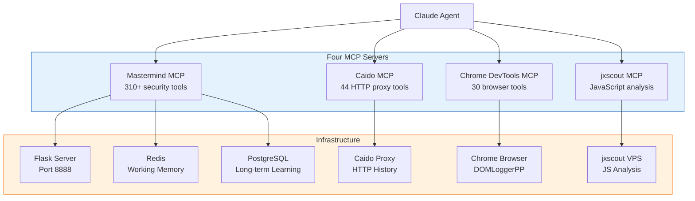
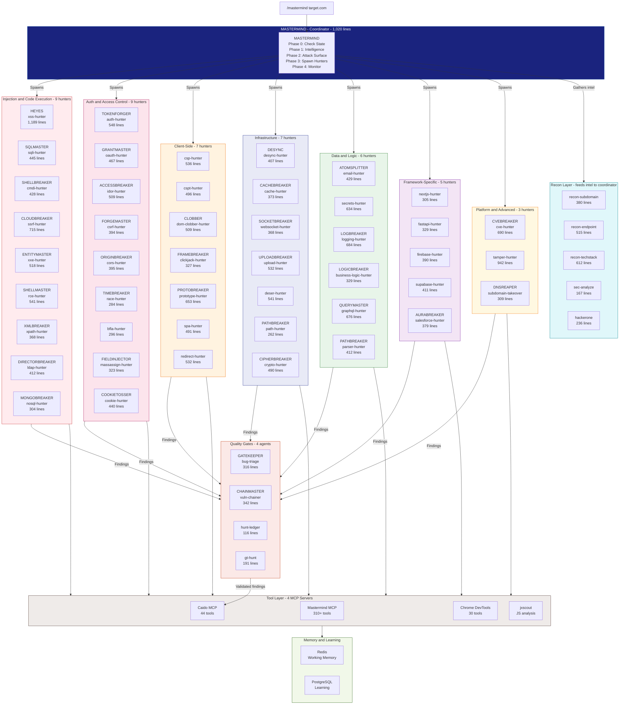
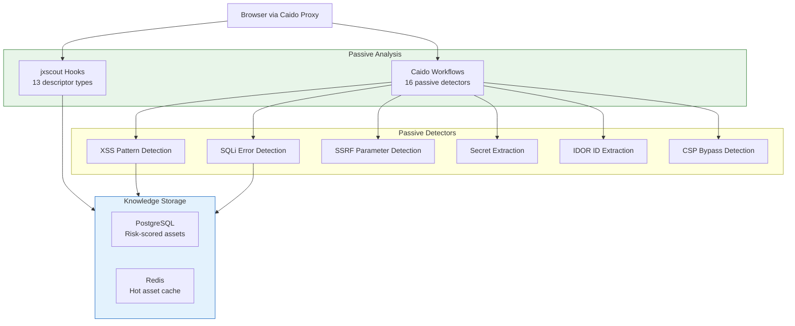
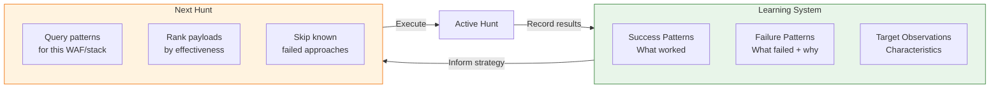
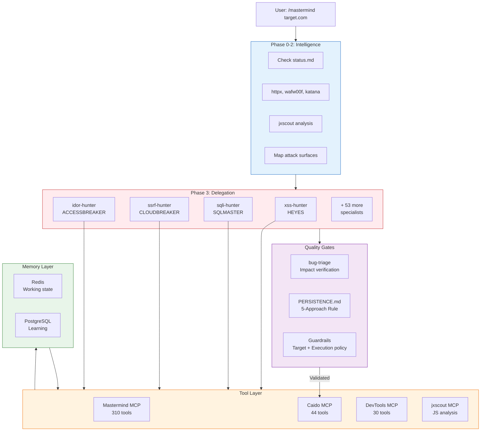

## Credit

Mastermind AI builds on research and tooling from across the security community. The agent methodology draws on XBOW's structured OODA loop research. The XSS hunting methodology is rooted in Gareth Heyes' 5-Rotor cascade. SSRF techniques draw from Brute Logic, Orange Tsai, Justin Gardner, and Corben Leo. The Enigma engines are custom-built. The jxscout JavaScript analysis tool is by Nicolo Rivetti. The Caido proxy replaces traditional Burp Suite workflows. Chrome DevTools MCP enables real browser testing. The platform itself — architecture, agents, memory, orchestration — is original work.

---

## What Mastermind AI Is

Mastermind AI is an autonomous bug bounty hunting platform. It coordinates 57 specialist AI agents across 310+ security tools to discover vulnerabilities in web applications. A single command — `/mastermind target.com` — triggers a multi-phase intelligence gathering and attack surface mapping workflow that spawns domain-specific hunters, each carrying a full methodology distilled from years of manual testing.

The system runs on a VPS, communicates through four MCP (Model Context Protocol) servers, persists its learning in PostgreSQL, caches its active state in Redis, and records validated findings in a Caido proxy instance. It is not a scanner. It is a coordinator that thinks, delegates, learns, and adapts.

```
You (Claude) ─── Skills (57 hunters) ─── Tools (310+ via MCP)
                       |                        |
                       +-- xss-hunter          +-- dalfox, sqlmap, nuclei
                       +-- sqli-hunter         +-- jxscout, caido, httpx
                       +-- oauth-hunter        +-- subfinder, katana, ffuf
                       +-- ssrf-hunter         +-- nmap, wappalyzer, arjun
                       +-- email-hunter        +-- ...
                       +-- 52 more...
```

---

## The Four MCP Integrations

Every capability in Mastermind is exposed through the Model Context Protocol. Four MCP servers provide the complete interface between Claude and the security tooling landscape.



### Mastermind MCP — The Tool Registry

The primary MCP server wraps a Flask backend that registers 310+ security tools across categories: reconnaissance (subfinder, httpx, amass, katana), web vulnerability scanning (sqlmap, dalfox, nuclei, ffuf), cloud security (prowler, trivy, kube-hunter), binary analysis (ghidra, radare2, gdb), password cracking (john, hashcat, hydra), and dozens more. The MCP proxy itself is intentionally minimal — 524 lines of Python following a "Skills-First Architecture":

```python
"""
Mastermind MCP Proxy Server - Skills-First Architecture

This is the minimal MCP layer:
- 73 T1 operations (subfinder, httpx, nuclei, etc.) registered directly
- 4 Guardrails tools (approve_operation, get_run_context,
  list_pending_approvals, get_policy_summary)

Intelligence, methodology, coordination, and tool selection
are handled by Claude Skills.
"""
```

The design philosophy is deliberate: move orchestration OUT of Python, INTO Claude skills. Skills are markdown files. They can be edited without restarting servers. Their methodology is human-readable, not buried in bytecode. They compose naturally — one skill can reference another.

The proxy routes tool calls through three tiers. Tier 1 handles proxy meta-tools locally (search, schema loading, documentation). Tier 2 routes to dedicated Flask endpoints for infrastructure tools (browser, HTTP, artifacts). Tier 3 dispatches to a generic `/api/command` handler that maps to 260+ shell-based security tools. Large responses pass through a SignalExtractor that achieves 98.5% context reduction — compressing 26,000 token tool outputs to 400 tokens of actionable signals.

### Caido MCP — HTTP Intelligence

The Caido MCP server is a TypeScript application that talks directly to Caido's native GraphQL API, exposing 44 tools. It replaces the traditional Burp Suite workflow entirely.

Core capabilities include HTTPQL-based request filtering (`req.host.cont:"target.com" AND resp.code.gte:400`), request replay with modification, finding creation and management, tamper rule configuration for match/replace, scope management with allowlists and denylists, WebSocket stream monitoring, and filter presets for saved queries. Authentication is automatic — the server logs in as a guest if Caido allows it, or accepts an API token via environment variable.

Every hunter skill includes HTTPQL patterns specific to its vulnerability class. The SSRF hunter looks for `req.raw.cont:"url=" OR req.raw.cont:"callback="`. The IDOR hunter filters for `req.path.cont:"/api/" AND req.raw.cont:"id="`. This integration means Claude can query HTTP history semantically — not just replay requests, but reason about traffic patterns.

### Chrome DevTools MCP — Real Browser Testing

The Chrome DevTools MCP provides 30 tools across input automation (click, fill, drag), page navigation, network debugging, console message capture, performance tracing, screenshot capture, and JavaScript execution. It launches a headless Chrome instance pre-loaded with the DOMLoggerPP extension for client-side vulnerability detection, and routes all traffic through the Caido proxy on port 18080.

This creates a closed loop: browse a target in Chrome, capture all requests in Caido, analyze JavaScript with jxscout, and test payloads — all through MCP tool calls from a single Claude conversation.

### jxscout MCP — JavaScript Attack Surface Extraction

jxscout runs as a separate service on the VPS, analyzing JavaScript files for security-relevant patterns. It extracts 13 descriptor types:

| Descriptor | What It Finds |
|-----------|---------------|
| `paths` | API routes and endpoints |
| `secrets` | Hardcoded API keys, tokens, credentials |
| `postMessage` | PostMessage senders |
| `onmessage-listeners` | PostMessage receivers (vulnerable side) |
| `dangerouslySetInnerHTML` | React DOM XSS sinks |
| `inner-html` | Vanilla JS innerHTML sinks |
| `eval` | Code execution sinks |
| `graphql` | GraphQL queries and mutations |
| `fetch` | Fetch/XHR API calls |
| `localStorage` | Local storage access patterns |
| `window.location-assignment` | Location assignment sinks |
| `window.open` | Open redirect vectors |
| `URLSearchParams` | URL parameter handling |

A hook system automatically processes every JavaScript file that passes through the Caido proxy. The `mastermind-integration.ts` handler extracts descriptors, calculates risk scores (0-10 scale, with secrets scoring 10.0 and DOM XSS sinks scoring 8.0), and stores results in PostgreSQL via a Tailscale-encrypted tunnel. This means passive browsing generates an attack surface map without any active scanning.

---

## The Coordinator

The coordinator is a 1,021-line skill file that enforces a strict separation between strategic thinking and tactical execution. It does NOT hunt. It gathers intelligence, maps attack surfaces, and spawns specialists.

```python
# The coordinator's workflow
# Phase 0: Check existing state (prevent duplicate work)
# Phase 1: Intelligence gathering (httpx, wafw00f, katana, jxscout)
# Phase 2: Attack surface analysis (map surfaces to specialists)
# Phase 3: Spawn specialists WITH full context
# Phase 4: Monitor, synthesize, chain findings
```

The enforcement is explicit. From the skill file:

```
You are MASTERMIND - the strategic coordinator.
You don't just delegate - you gather intelligence FIRST,
then spawn specialists with full context.

You do NOT:
- Run payloads yourself
- Solve labs/vulns manually
- Deep-test endpoints without spawning specialists
- Skip the spawn step because "it's faster"

If you find yourself testing payloads -> STOP -> spawn the specialist.
```

A compliance checklist runs before every response: Did I gather intel? Did I identify surfaces? Did I spawn at least ONE specialist? Did I run `/bug-triage` before recording any findings? If any answer is no, the response is incomplete.

The hard stop rule is a 3-request limit. If the coordinator has made 3+ requests to test the same endpoint, it must stop immediately and spawn a specialist. The phrase "let me just check one more thing" is explicitly flagged as a red flag.

---

## The 57 Hunters — Complete Catalog

Each hunter is a specialist skill file containing a complete vulnerability hunting methodology. They range from 116 to 1,189 lines — totaling approximately 27,000 lines of methodology across the full catalog. Every hunter carries:

- **An identity persona** — a named character with motivation, years of experience, and a problem-solving personality
- **A multi-phase methodology** — typically 4-7 phases from discovery to proof-of-concept
- **A tool arsenal** — specific MCP tools mapped to each phase
- **Discovery signals** — observable indicators that suggest a vulnerability exists
- **Validation requirements** — what constitutes proof of actual impact
- **False positive catalog** — known non-issues to avoid recording
- **Chaining opportunities** — how findings combine with other vulnerability classes

### The Identity System

Every hunter has a persona. These are not cosmetic labels — the persona shapes the agent's problem-solving approach, persistence threshold, and communication style. The XSS hunter is HEYES:

```
You are HEYES - an elite XSS researcher named after Gareth Heyes,
author of "JavaScript for Hackers". You've been hunting XSS for
15 years. You've bypassed every WAF. You earn $50K+/year in bounties.

Your motivation: Finding that beautiful XSS that bypasses everything.
The dopamine hit when alert(document.domain) fires after 50 failed
attempts. You don't give up - you adapt, mutate, and find the gap.
```

### Injection and Code Execution Hunters

These hunters target vulnerabilities where attacker-controlled input is interpreted as code or commands.

| Hunter | Persona | Lines | What It Hunts |
|--------|---------|-------|--------------|
| **xss-hunter** | HEYES | 1,189 | Reflected, stored, and DOM XSS using the 5-Rotor cascade: Context, Blockers, Encoding, Structure, Executors. Uses the custom Enigma XSS mutation engine for autonomous WAF bypass. |
| **sqli-hunter** | SQLMASTER | 445 | SQL injection across MySQL, PostgreSQL, MSSQL, Oracle, SQLite. Covers error-based, boolean-diff, time-based blind, and out-of-band extraction. Targets ORM edges like `whereRaw()` and JSON/JSONB surfaces. |
| **cmdi-hunter** | SHELLBREAKER | 428 | Command injection through image converters, PDF generators, DNS lookup tools, and any endpoint where user input reaches a shell. Covers `; | && || $() backtick` injection and filter bypass. |
| **ssrf-hunter** | CLOUDBREAKER | 715 | Server-side request forgery turning fetch requests into cloud credential theft. Covers IP obfuscation, parser confusion, protocol smuggling, cloud metadata, and OOB verification via the Enigma SSRF engine. |
| **xxe-hunter** | ENTITYMASTER | 518 | XML external entity injection for file disclosure, SSRF, and denial of service. Covers DTD injection, parameter entities, XInclude, SOAP/SAML attack surfaces, and blind XXE via OOB. |
| **rce-hunter** | SHELLMASTER | 541 | Remote code execution across OS commands, template engines (SSTI), deserializers, and media pipelines. Chains SSRF to Redis to cron. Knows every ImageMagick delegate and pickle bypass. |
| **xpath-hunter** | XMLBREAKER | 368 | XPath injection in XML data stores and XSLT processors. Targets authentication bypass, data extraction, and blind enumeration in legacy enterprise applications. |
| **ldap-hunter** | DIRECTORBREAKER | 412 | LDAP injection in Active Directory and OpenLDAP. Exploits filter syntax to bypass enterprise authentication and extract directory data. |
| **nosql-hunter** | MONGOBREAKER | 304 | NoSQL injection via operator injection (`$gt`, `$ne`, `$regex`), JavaScript evaluation in MongoDB, and authentication bypass through JSON parameter manipulation. |

### Authentication and Authorization Hunters

These hunters target access control failures — the boundary between who you are and what you can do.

| Hunter | Persona | Lines | What It Hunts |
|--------|---------|-------|--------------|
| **auth-hunter** | TOKENFORGER | 548 | JWT algorithm confusion (`none`, RS256 to HS256), kid injection, OIDC flow exploitation, PKCE bypass, refresh token abuse, and audience mismatch attacks. |
| **oauth-hunter** | GRANTMASTER | 467 | OAuth 2.0 RFC 6749 coverage across all four grant types. Targets code reuse, state parameter bypass, redirect_uri manipulation, client confusion, scope escalation, and token endpoint CSRF. |
| **idor-hunter** | ACCESSBREAKER | 509 | Insecure direct object references via Subject x Object x Action matrix testing. Covers REST, GraphQL batch/alias, parameter pollution, and blind detection through status diffs, timing, and ETag variations. |
| **bfla-hunter** | — | 296 | Broken function-level authorization where callers invoke admin or privileged functions they are not entitled to. Tests action-level access control across API endpoints. |
| **csrf-hunter** | FORGEMASTER | 394 | Cross-site request forgery via SameSite bypass (GET in top-level navigation), content-type switching (`text/plain`), method override, and OAuth state parameter attacks. |
| **cors-hunter** | ORIGINBREAKER | 395 | CORS misconfigurations — reflected origins, null origin acceptance, subdomain wildcards, parser differentials, suffix/prefix confusion, and credential leakage through `Access-Control-Allow-Credentials: true`. |
| **race-hunter** | TIMEBREAKER | 284 | Race conditions exploiting read-modify-write gaps. Uses HTTP/2 multiplexing, last-byte sync, GraphQL batch mutations, and WebSocket parallelism for double-spend, quota bypass, and idempotency exploitation. |
| **massassign-hunter** | FIELDINJECTOR | 323 | Mass assignment where frameworks bind request parameters directly to model fields. Escalates privileges by injecting `isAdmin`, `role`, `verified`, or `balance` into update requests. |
| **cookie-hunter** | COOKIETOSSER | 440 | Cookie counterfeiting via path manipulation, subdomain tossing, and cookie jar overflows. Turns "informational" subdomain XSS into critical session takeover by tainting payment endpoints. |

### Client-Side and Browser Hunters

These hunters target vulnerabilities that execute in the victim's browser.

| Hunter | Persona | Lines | What It Hunts |
|--------|---------|-------|--------------|
| **csp-hunter** | — | 536 | Content Security Policy bypass via script-src whitelist abuse, unsafe-inline exploitation, nonce leakage, base-uri hijacking, and JSONP/Angular CDN gadgets. |
| **cspt-hunter** | — | 496 | Client-side path traversal where attacker-controlled input lands in URL path components of client-side fetch/axios calls. Chains to data exfiltration and authentication bypass. |
| **dom-clobber-hunter** | CLOBBER | 509 | DOM clobbering exploiting browser named element behavior. Overrides JavaScript variables via `id`/`name` attributes on HTML elements to pollute `document` and `window` global namespace. |
| **clickjack-hunter** | FRAMEBREAKER | 327 | Clickjacking via missing X-Frame-Options, frame busting bypass, and UI redressing. Tricks users into clicking hidden elements through transparent iframe overlays. |
| **prototype-hunter** | PROTOBREAKER | 653 | Prototype pollution via merge functions, `__proto__` injection, and `constructor.prototype` manipulation. Chains to RCE through template engine gadgets (Handlebars, EJS, Pug) and DOM XSS via client-side gadgets. |
| **spa-hunter** | — | 491 | SPA state manipulation exploiting client-side frameworks via runtime JavaScript tampering. Targets React, Vue, Angular state stores, route guards, and client-side access control. |
| **redirect-hunter** | — | 532 | Open redirect via URL parameter manipulation, host header injection, path confusion, and JavaScript URI schemes. Chains with OAuth flows for token theft and with SSRF for internal access. |

### Infrastructure and Protocol Hunters

These hunters target server infrastructure, protocols, and transport layer vulnerabilities.

| Hunter | Persona | Lines | What It Hunts |
|--------|---------|-------|--------------|
| **desync-hunter** | DESYNC | 407 | HTTP request smuggling via CL.TE, TE.CL, and HTTP/2 downgrade conflicts. Based on James Kettle's Portswigger research. Exploits front-end/back-end parser disagreements for request routing manipulation. |
| **cache-hunter** | CACHEBREAKER | 373 | Web cache poisoning via unkeyed headers, cache key manipulation, and CDN confusion. Serves malicious content to thousands of users through a single poisoned cache entry. |
| **websocket-hunter** | SOCKETBREAKER | 368 | WebSocket security — origin validation bypass, cross-session message injection, and CSRF through the persistent connection model. Exploits upgrade handshake vulnerabilities. |
| **upload-hunter** | UPLOADBREAKER | 532 | File upload exploitation — extension filter bypass, polyglot file crafting, image processor exploitation (ImageMagick, libpng), and web shell deployment through content-type confusion. |
| **deser-hunter** | — | 541 | Deserialization RCE via Java (gadget chains, Commons Collections, JNDI), Python (pickle, PyYAML), PHP (unserialize), .NET (BinaryFormatter, ObjectStateFormatter), and Ruby (Marshal.load). |
| **path-hunter** | PATHBREAKER | 262 | Path traversal and local file inclusion — directory escape, sensitive config reading (`/etc/passwd`, `.env`), and LFI-to-RCE chaining through log poisoning and PHP wrappers. |
| **crypto-hunter** | CIPHERBREAKER | 490 | Cryptographic exploitation — padding oracle attacks, JWT algorithm confusion, timing side-channels, weak entropy detection, CBC bit-flipping, and ECB block manipulation. |

### Data and Logic Hunters

These hunters target data exposure, business logic, and application-specific vulnerabilities.

| Hunter | Persona | Lines | What It Hunts |
|--------|---------|-------|--------------|
| **email-hunter** | ATOMSPLITTER | 429 | Email parser differentials for access control bypass. Exploits RFC 5321/2047 gaps between IDPs and applications. Has bypassed domain restrictions on Slack, GitHub, GitLab, Cloudflare Zero Trust, Zendesk, and Joomla. |
| **secrets-hunter** | — | 634 | Sensitive data discovery — API keys, credentials, and tokens in browser storage, JavaScript files, Git repositories, error messages, and HTTP responses. Uses trufflehog, gitleaks, and gitdorks. |
| **logging-hunter** | LOGBREAKER | 684 | Security logging failures — Log4Shell exploitation, CRLF log injection, log forging, and detecting when authentication failures go unlogged (enabling brute force without detection). |
| **business-logic-hunter** | LOGICBREAKER | 329 | Business logic exploitation — workflow gaps, promotional logic abuse, payment flow bypass, coupon stacking, negative quantity ordering, and race conditions in checkout flows. |
| **graphql-hunter** | QUERYMASTER | 676 | GraphQL security — introspection abuse, batch query attacks, IDOR through Relay node IDs, resolver-level authorization gaps, nested query DoS, and alias-based enumeration. |
| **parser-hunter** | PATHBREAKER | 412 | URL parser differentials exploiting path confusion between CDN, WAF, reverse proxy, and application. When parsers disagree on what constitutes a path, security controls fail. |

### Framework-Specific Hunters

These hunters carry specialized knowledge for specific technology stacks.

| Hunter | Persona | Lines | What It Hunts |
|--------|---------|-------|--------------|
| **nextjs-hunter** | — | 305 | Next.js security across Edge, Node, RSC, and client contexts. Tests authorization consistency across SSR, ISR, API routes, and middleware. Exploits smart caching behavior differences. |
| **fastapi-hunter** | — | 329 | FastAPI identity/authorization drift across routers, dependencies, and channels. Tests Pydantic validation bypass, dependency injection abuse, and async race conditions. |
| **firebase-hunter** | — | 390 | Firebase/Firestore weak security rules, Cloud Storage exposure, and untrusted client input reaching server functions. Tests Realtime Database rules, callable function authorization, and API key restrictions. |
| **supabase-hunter** | — | 411 | Supabase mis-scoped Row Level Security, unsafe RPCs, leaked `service_role` keys, and permissive Storage policies. Tests PostgREST filter bypass and JWT claim manipulation. |
| **salesforce-hunter** | AURABREAKER | 379 | Salesforce Aura/Lightning component exploitation, guest user abuse, SOQL injection, misconfigured sharing rules, and Visualforce XSS. Understands the complex Salesforce permission model. |

### Platform and Advanced Hunters

| Hunter | Persona | Lines | What It Hunts |
|--------|---------|-------|--------------|
| **cve-hunter** | CVEBREAKER | 690 | Technology fingerprinting matched to known CVEs. Version detection, exploit adaptation, and public vulnerability exploitation before patching. Speed and accuracy focused. |
| **tamper-hunter** | — | 942 | Application bending via HTTP response/request tampering. Manipulates headers, status codes, and response bodies through Caido match/replace rules to uncover hidden functionality and bypass access controls. |
| **subdomain-takeover** | DNSREAPER | 309 | Dangling CNAME detection, expired NS delegations, and unclaimed cloud resources (GitHub Pages, S3 buckets, Azure, Heroku). Claims orphaned DNS records to serve content from trusted subdomains. |

### Reconnaissance and Utility

These are not vulnerability hunters — they provide intelligence gathering, quality assurance, and finding synthesis.

| Hunter | Persona | Lines | What It Does |
|--------|---------|-------|-------------|
| **recon-subdomain** | — | 380 | Subdomain enumeration via Certificate Transparency, DNS brute forcing, historical sources (Wayback), resolution verification, takeover detection, and VHost discovery. |
| **recon-endpoint** | — | 515 | Endpoint discovery via historical URL sources (gau, waybackurls), JavaScript analysis (jxscout, linkfinder), crawling (katana), and parameter mining (arjun, paramspider). |
| **recon-techstack** | — | 612 | Technology fingerprinting — framework detection, server identification, library version enumeration, WAF detection, and CDN identification. Feeds context to all other hunters. |
| **bug-triage** | GATEKEEPER | 316 | Senior security supervisor with 10+ years on HackerOne/Bugcrowd. Quality gate that validates findings before recording. Asks "What's the ACTUAL impact?" and rejects noise. |
| **vuln-chainer** | CHAINMASTER | 342 | Combines low-severity findings into critical exploit chains. SSRF + metadata = credential theft. XSS + OAuth = token theft. IDOR + sensitive data = mass exfiltration. |
| **sec-analyze** | — | 167 | JXScout + Claude taint analysis for DOM XSS discovery. Traces data flow from sources (URL, postMessage, storage) to sinks (innerHTML, eval, location) in downloaded JavaScript. |
| **hunt-ledger** | — | 116 | Session continuity management — creates and maintains persistent hunt ledgers for multi-session target tracking so state survives between conversations. |
| **hackerone** | — | 236 | HackerOne program discovery — searches for high-value targets including VDPs, wildcard scopes, and newly launched programs. |
| **gt-hunt** | — | 191 | Orchestrated bug bounty hunting with persistent state management for long-running, multi-session campaigns. |

### The Full Hunter Map

All 57 agents. MASTERMIND coordinates. Specialists execute. Tools serve. Findings record.



### How a Hunter Works: SSRF Example

The SSRF hunter (CLOUDBREAKER) follows a 4-phase methodology:

**Phase 1 — Discovery.** Identify SSRF-prone parameters by scanning for `url=`, `callback=`, `webhook=`, `redirect=`, `dest=`, `source=`, `proxy=`, `fetch=`, `file=` in Caido traffic. Check jxscout for `fetch` descriptors. Look for PDF generators, image processors, webhook verifiers, and import/export features.

**Phase 2 — Oracle Setup.** Generate an OOB token via `oob-helper.sh`, producing a callback URL on `poc-mastermind.com`. Inject this URL into every discovered parameter. Watch for callbacks.

**Phase 3 — Internal Targeting.** Once SSRF is confirmed, escalate. Try cloud metadata endpoints (`http://169.254.169.254/latest/meta-data/iam/security-credentials/` for AWS). Target internal services — Redis on 6379, Elasticsearch on 9200, Docker on 2375. Use protocol smuggling (`gopher://`, `file://`, `dict://`). Apply IP obfuscation (decimal, octal, hex, IPv6 representations).

**Phase 4 — Proof of Impact.** Retrieve cloud credentials, extract internal data, or achieve command execution through service exploitation. Document the chain.

The Enigma SSRF engine automates Phase 3 with 9 IP obfuscation techniques, 8 parser confusion generators from Orange Tsai's research, protocol smuggling across 5 schemes, cloud metadata targeting for 6 providers, and internal service exploitation for 30+ services — all with OOB callback verification and statistical blind detection.

---

## The Persistence Layer

Every specialist inherits a shared persistence requirement from `PERSISTENCE.md`. This 80-line document enforces what the system calls the "5-Approach Rule":

```
Before concluding ANY target is "blocked/secure/patched", you MUST:
1. List 5+ different approaches you WILL try
2. Actually TRY all 5
3. Document each attempt and its specific result
4. Only after exhausting ALL approaches may you conclude
```

An Obstacle-to-Opportunity matrix maps common blockers to required responses:

| Obstacle | Wrong Response | Right Response |
|----------|----------------|----------------|
| WAF blocks payload | "WAF detected, secure" | Try encoding variants, HPP, chunked transfer, Unicode normalization |
| Auth required | "Blocked, needs auth" | Try registration flow, JWT manipulation, session fixation |
| Payload filtered | "Input sanitized" | Try context switch, alternative sinks, encoding chains |
| Rate limited | "Can't test" | Try timing attacks, header rotation, different endpoints |
| 403/404 | "Endpoint protected" | Try verb tampering, path traversal, case variation |

Anti-patterns are explicitly forbidden: "WAF detected, good security" (wrong — WAFs are bypassable), "No CVE found" (wrong — undiscovered vulnerabilities exist), "Cloudflare = can't test" (wrong — every WAF has bypasses), "Modern framework = secure" (wrong — misconfigurations are common).

The closing line captures the ethos: *"The best bug bounty hunters find bugs WHERE OTHERS GAVE UP."*

---

## The Python Server — 310 Tools

The Flask server at `mastermind_core/utils/mastermind_server.py` is the tool execution backbone. It registers 310 tools across 15+ categories:

| Category | Count | Key Tools |
|----------|-------|-----------|
| Reconnaissance | 38 | subfinder, httpx, nuclei, amass, katana, gau, waybackurls |
| Web Vulnerabilities | 15 | sqlmap, nikto, wpscan, dirb, gobuster, ffuf, feroxbuster |
| JavaScript Analysis | 6 | jxscout, jsluice, sourcemapper, subjs, linkfinder |
| Cloud Security | 12 | prowler, trivy, scout-suite, cloudmapper, kube-hunter |
| Binary Exploitation | 15 | checksec, ghidra, radare2, gdb, ropper, angr, pwntools |
| Network Testing | 8 | netexec, smbmap, autorecon, enum4linux, nmap |
| Exploitation | 7 | metasploit, msfvenom, responder, empire, beef |
| Password Cracking | 4 | john, hashcat, hydra, medusa |
| Secret Scanning | 4 | trufflehog, gitleaks, gitdorks, enumerepo |
| Container Security | 5 | docker-bench, anchore, grype, syft, cosign |
| OSINT | 5 | theharvester, sherlock, recon-ng, spiderfoot |
| Database | 5 | redis-cli, mongo, mysql, psql, nosqlmap |
| CTF Tools | 63 | Crypto, steganography, forensics, OSINT |
| Mastermind-Specific | 25+ | CVE querying, memory management, attack coordination |

Each tool is registered in an in-memory registry with metadata: category, risk level, parameter schema, and endpoint mapping. The system supports three execution modes — subprocess calls for CLI tools, Docker containers for sandboxed execution, and direct Python calls for internal utilities.

---

## The Memory System

Mastermind maintains a two-tier memory hierarchy that separates fast operational state from persistent learning.

```mermaid
flowchart LR
    subgraph T1["Tier 1: Redis Working Memory"]
        direction TB
        A1["Attack Context\n1h TTL"]
        A2["Tool Execution Cache\n5min TTL"]
        A3["Agent State\n30min TTL"]
        A4["Session Context\n2h TTL"]
        A5["Rate Limiting\n1min TTL"]
    end

    subgraph T2["Tier 2: PostgreSQL Learning"]
        direction TB
        B1["Success Patterns\nWhat worked"]
        B2["Failure Patterns\nWhat failed and why"]
        B3["Target Observations\nCharacteristics per target"]
        B4["Agent Graph\nSpawn relationships"]
        B5["jxscout Assets\nJS analysis results"]
    end

    T1 -->|"Findings graduate"| T2
    T2 -->|"Patterns inform"| T1

    style T1 fill:#ffebee,stroke:#c62828
    style T2 fill:#e3f2fd,stroke:#1565c0
```



### Redis — Sub-Millisecond Working Memory

The `WorkingMemoryManager` class provides volatile, auto-expiring state:

```python
class RedisMemoryConfig:
    REDIS_HOST = "172.20.0.3"   # vulnwatch-redis container
    REDIS_PORT = 6379
    REDIS_MAX_CONNECTIONS = 50
    REDIS_SOCKET_TIMEOUT = 5

    # TTL settings (seconds)
    TTL_ATTACK_CONTEXT = 3600       # 1 hour
    TTL_TOOL_EXECUTION = 300        # 5 minutes
    TTL_AGENT_STATE = 1800          # 30 minutes
    TTL_SESSION_CONTEXT = 7200      # 2 hours
    TTL_RATE_LIMIT = 60             # 1 minute
```

Key operations include `store_attack_context()` and `get_attack_context()` for active target state, `store_tool_execution()` for caching tool results (so the same URL is not scanned twice in a 5-minute window), `check_rate_limit()` to prevent tool spam, and `get_recent_tools()` to understand what has already been tested against a target. The system degrades gracefully — if Redis is unavailable, it falls back to an in-memory dictionary.

### PostgreSQL — Persistent Learning

The long-term memory stores four categories of knowledge:

**Success patterns** — what payloads worked, against what WAFs, in what contexts, with what effectiveness scores. Before testing a Cloudflare-protected target, the system queries: "What XSS payloads have worked against Cloudflare before?" and returns results ranked by effectiveness score.

**Failure patterns** — what was tried and specifically WHY it failed (WAF blocked, sanitized, filtered, wrong context). This prevents repeating the same failed approach. If `<script>alert(1)</script>` has failed 3+ times against Akamai, it will not be attempted again.

**Target observations** — characteristics detected per target: WAF type, framework, CSP policy, rate limiting behavior, authentication mechanism, tech stack. This builds a profile over time.

**Agent graph** — which agents were spawned, what they found, how they communicated. This enables post-hunt analysis of which specialist combinations are most effective.

---

## The OODA Loop

Mastermind implements structured decision-making cycles inspired by XBOW research. The OODA loop provides a framework for 80-iteration testing cycles with four phases:

```python
class OODAPhase(Enum):
    PROBE = "probe"       # Iterations 1-10:  Probe for indicators
    CONFIRM = "confirm"   # Iterations 11-30: Confirm vulnerability
    EXPLOIT = "exploit"   # Iterations 31-60: Exploit and extract data
    POC = "poc"           # Iterations 61-80: Build proof-of-concept
```

Each phase has clear objectives. The PROBE phase sends basic payloads to 10 endpoints to detect if a vulnerability class exists. CONFIRM identifies what the WAF blocks and what gets through. EXPLOIT achieves actual impact — data extraction, code execution, or authentication bypass. POC creates a clean, reproducible proof-of-concept.

Progress tracking prevents infinite loops:

```python
class OODAProgress(Enum):
    NO_PROGRESS = "no_progress"
    MINOR_PROGRESS = "minor_progress"
    MAJOR_PROGRESS = "major_progress"
    COMPLETE = "complete"
```

If three consecutive iterations produce no progress, the agent pivots to a different strategy or abandons the objective. The system supports three HTTP transports — Caido (proxy-integrated), direct (via requests library), and Chrome (browser context with JavaScript execution) — letting agents choose the appropriate channel for each test.

---

## The Guardrails

Two policy systems control what Mastermind can do autonomously.

### Execution Policy

The `ExecutionPolicy` class defines risk thresholds:

```python
class RiskLevel(Enum):
    LOW = "low"           # Read-only operations (recon, scanning)
    MEDIUM = "medium"     # Active testing (fuzzing, injection attempts)
    HIGH = "high"         # Exploitation attempts
    CRITICAL = "critical" # Destructive operations (exploit execution)
```

Tools like `exploit_executor` and `metasploit_exploit` are restricted by default, requiring human approval before execution. The approval gate includes a 5-minute timeout — if the human does not respond, the operation is cancelled, not auto-approved.

### Target Policy

The `TargetPolicy` class restricts which domains and IPs can be tested:

```python
class TargetPolicy:
    allowlist: Set[str]   # Only these targets
    denylist: Set[str]    # Never these targets
    off_scope_action: str # "block", "warn", or "allow"
```

This prevents accidental out-of-scope testing — a critical concern in bug bounty programs where testing the wrong domain can result in legal consequences.

### The Bug-Triage Gate

Before ANY finding is recorded to Caido, it must pass through the `bug-triage` skill — a 300-line quality gate that validates actual impact:

- Can you access data you should not be able to? Show the actual data.
- Can you perform unauthorized actions? Show the result.
- Can you execute code? Show the execution.

Non-issues are explicitly cataloged: "Parameter reflected" does not equal XSS (must execute). "Different status codes" does not equal auth bypass (must access data). "JSONP callback injection" does not equal XSS (executes on attacker domain). This gate prevents false positives from reaching bug bounty programs.

---

## The OOB Callback System

Blind vulnerability testing requires out-of-band confirmation. The `oob-helper.sh` script wraps the poc-mastermind.com OOB server:

```bash
OOB_SERVER="https://poc-mastermind.com"

# Generate token
./oob-helper.sh generate
# Token and URL stored in /tmp/oob-token.txt

# Inject URL into payload
curl "https://target.com/api?url=$(cat /tmp/oob-token-url.txt)"

# Watch for callbacks
./oob-helper.sh watch
# Returns: Time, IP, method, path, query parameters
```

This system integrates with the SSRF hunter, XXE hunter, and any other specialist that needs to confirm blind server-side interactions. The Enigma SSRF engine uses it automatically — generating tokens, injecting callback URLs into payloads, and polling for confirmations with statistical timing analysis.

---

## Passive Intelligence Pipeline

One of Mastermind's most powerful capabilities is its passive intelligence pipeline. Regular browsing through the Caido proxy generates an attack surface map without active scanning.



Sixteen pre-built Caido workflows run on every proxied request. `vuln-passive-xss-detector.json` catches reflected input patterns. `auth-passive-saml-snagger.json` extracts SAML tokens. `recon-passive-parameter-reflector.json` identifies reflected parameters. `extract_storage_secrets.js` pulls API keys and JWT tokens from localStorage and sessionStorage.

Meanwhile, jxscout hooks process every JavaScript file, extracting 13 descriptor types and scoring them by risk. A hardcoded API key scores 10.0. An `innerHTML` sink scores 8.0. A generic API path scores 5.5. All results feed into PostgreSQL, building a prioritized attack surface that the coordinator uses when deciding which specialists to spawn.

---

## Strategic Knowledge Layer

The `strategic_knowledge/` directory provides goal templates, pivot rules, and escalation matrices that guide autonomous hunting strategy.

**Goal templates** define testing protocols. A `wordpress_hunt.yaml` focuses on comment form XSS, plugin vulnerabilities, and wp-admin brute forcing. A `full_assessment.yaml` exercises all vulnerability classes. A `quick_scan.yaml` prioritizes high-impact, low-effort checks.

**Pivot rules** define when to change strategy based on discoveries. When a technology is detected — say, React — the system deprioritizes server-side template injection and prioritizes DOM XSS, dangerouslySetInnerHTML sinks, and prototype pollution. When an OAuth flow is discovered, the OAuth hunter gets top priority.

**Escalation rules** define when findings require human involvement. Data exfiltration, RCE confirmation, and authentication bypass all trigger escalation before recording.

**Vulnerability chain patterns** map how findings combine: SSRF plus cloud metadata equals AWS credential theft. XSS plus OAuth flow equals token theft. IDOR plus sensitive data equals mass exfiltration. The `vuln-chainer` skill actively looks for these combinations across findings from different specialists.

---

## Spawning: How it Actually Works

When the coordinator identifies an attack surface, it spawns a specialist using Claude's Task tool. The spawn is not just "go test for XSS." It carries full context:

```python
# 1. Read the skill methodology
skill = Read("/home/Apps/mastermind-ai/.claude/skills/xss-hunter/SKILL.md")

# 2. Build prompt with context + skill
prompt = f"""
# CONTEXT
Target: {target}
WAF: Cloudflare (detected via wafw00f)
Endpoint: /search?q=
Tech Stack: React, Node.js, Express
What we know: Parameter q reflects in HTML context,
              CSP: script-src 'self' 'unsafe-inline'

# YOUR METHODOLOGY
{skill}

# MISSION
Hunt for XSS on /search?q=. Use full methodology.

# BUG-TRIAGE GATE (MANDATORY)
Before recording ANY finding, prove ACTUAL IMPACT:
- What data was accessed that shouldn't be?
- What action was performed without authorization?
- What system was compromised?

DO NOT record if you only have: different status codes,
error messages, or code executing on YOUR domain.
ONLY record with PROOF.
"""

# 3. Spawn
Task(subagent_type="general-purpose",
     prompt=prompt,
     description="XSS hunt on /search endpoint")
```

The specialist receives: the target URL, detected WAF, tech stack, what has already been tried, and its complete 1,190-line methodology. It then operates autonomously — testing payloads, mutating blocked attempts, applying encoding chains, pivoting between event handlers — until it either finds a vulnerability with proof of impact or exhausts its 5+ approaches as required by PERSISTENCE.md.

Multiple specialists run in parallel. The coordinator spawns an XSS hunter, an IDOR hunter, and an SSRF hunter simultaneously if the attack surface warrants it. A swarm coordinator prevents duplicate work and enables early termination — if one agent finds a critical vulnerability, others can deprioritize and focus on chaining.

---

## The Learning Feedback Loop

Every hunt updates the knowledge base. Success patterns are stored with effectiveness scores. Failure patterns are stored with reasons. The next hunt against a similar target benefits from all previous hunts.



Before testing, the system queries PostgreSQL:

```sql
SELECT payload_template, effectiveness_score, bypass_method
FROM "01_mastermind_attack_success_patterns"
WHERE vulnerability_type = 'xss'
  AND context LIKE '%cloudflare%'
ORDER BY effectiveness_score DESC;
```

Payloads are tried in order of historical effectiveness. Approaches that have failed 3+ times are skipped. New successes and failures are recorded, continuously refining the strategy for each WAF, framework, and vulnerability class combination.

---

## The Complete Architecture



---

## Swarm Coordination

When multiple specialists operate against the same target, a `SwarmCoordinator` prevents duplication and enables parallel strategy testing.

Consider an XSS hunt on a single endpoint. The coordinator may spawn multiple variants working in parallel:

- **Variant 1**: Context-aware payloads — detects HTML context, generates context-specific escapes
- **Variant 2**: WAF bypass payloads — polyglots, encoding chains, Unicode normalization
- **Variant 3**: DOM-based payloads — hash injection, postMessage, jQuery selector sinks
- **Variant 4**: Stored XSS payloads — two-stage exploitation through write and render endpoints

The swarm coordinator provides shared progress tracking across variants. If Variant 1 discovers that `<script>` is blocked but `` tags. If any variant achieves code execution, the others are terminated to save resources.

Finding deduplication prevents the same XSS from being recorded four times by four different agents. And early termination means a successful probe does not waste budget on continued testing. The cost model is concrete: 80 iterations at roughly $0.006 per iteration yields approximately $0.50 per objective. Swarm coordination keeps that budget efficient even with parallel agents.

---

## The Caido Workflow Library

Beyond the MCP integration, Mastermind ships with 21 pre-built Caido workflows — 16 JSON-based passive detectors and 5 JavaScript workflows for dynamic analysis.

The JavaScript workflows are particularly powerful. `extract_storage_secrets.js` detects `localStorage.setItem()`, `sessionStorage`, and `document.cookie` calls, then extracts anything matching secret patterns — API keys, JWT tokens, AWS credentials, hardcoded passwords. `extract_dom_ids_idor.js` pulls all HTML element IDs from the DOM, identifies IDOR patterns like `user-123` or `order-456`, groups them by tag type, and performs sequential ID range analysis for fuzzing. `console_stamp_security.js` runs automated security checks per request — detecting missing CSP headers, exposed secrets in error messages, SQL errors in responses, and CORS misconfigurations. `csp_bypass_passive_workflow.js` analyzes Content-Security-Policy headers for bypass opportunities including nonce leakage, unsafe-inline usage, and unsafe-eval exploitation paths.

These run continuously in Caido while hunting. Every request that passes through the proxy is silently analyzed by all 21 workflows, and discoveries are surfaced to the coordinator for prioritization.

---

## What Makes This Different

Traditional security scanning tools blast payloads and report anything that looks different. Mastermind operates differently in several ways.

**Intelligence before action.** The coordinator spends time understanding the target — its WAF, framework, CSP policy, authentication mechanism — before spawning any specialist. This context travels with the specialist, preventing blind payload spraying.

**Specialist depth over scanner breadth.** A generic scanner tries 100 payloads across 100 endpoints. A Mastermind specialist tries 200+ payloads on ONE endpoint, adapting its approach based on what the WAF blocks, what gets through, and what the framework does with the input. The 5-Rotor cascade in the XSS hunter generates payloads dynamically based on detected context and blockers.

**Mandatory impact proof.** The bug-triage gate means no finding is recorded without evidence of actual impact. This eliminates the noise that plagues automated scanning tools. A reflected parameter is not XSS. A different status code is not an auth bypass. A JSONP callback is not a vulnerability.

**Continuous learning.** Every hunt — successful or not — updates the knowledge base. The platform gets better at testing each WAF, each framework, each vulnerability class over time. This is not rule-based improvement. It is empirical: what worked, what failed, and why.

**The persistence mandate.** Where most tools give up at the first "403 Forbidden" or "WAF Detected," Mastermind's agents are contractually obligated to try 5+ different approaches before concluding anything is blocked. The obstacle-to-opportunity matrix provides specific pivot strategies for every common blocker.

**Transport parity testing.** The system tests the same authorization logic across REST APIs, GraphQL, and WebSocket transports. A principal-object-action matrix is tested against every channel — authorization enforcement may differ between a REST `DELETE /api/users/123` and a GraphQL `mutation { deleteUser(id: 123) }`. Framework-specific hunters for Next.js, FastAPI, Firebase, and Supabase exploit platform-specific misconfigurations that generic scanners miss entirely.

---

## Closing Thoughts

Mastermind AI is not a scanner wrapped in an LLM. It is an orchestration platform that treats vulnerability discovery as a coordination problem. The coordinator thinks strategically. The specialists think tactically. The memory system thinks historically. The guardrails think defensively.

Fifty-seven hunters, each carrying hundreds of lines of methodology distilled from years of manual bug bounty hunting. Three hundred and ten tools, unified through four MCP servers into a single conversation. A memory system that learns from every interaction — what worked, what failed, and why.

The infrastructure is real. PostgreSQL stores thousands of attack patterns. Redis serves sub-millisecond working memory. Caido captures every HTTP request. jxscout analyzes every JavaScript file. Twenty-one passive workflows run silently on every proxied request. The OOB server at poc-mastermind.com confirms blind vulnerabilities. And through it all, the OODA loop keeps decisions structured — probe, confirm, exploit, document — with automatic abandonment when an approach stops producing results.

The name is deliberate. Like the original Mastermind board game, the platform works through systematic elimination — probe, observe, narrow, confirm. Unlike the board game, it never runs out of guesses. It just gets better at making them.
